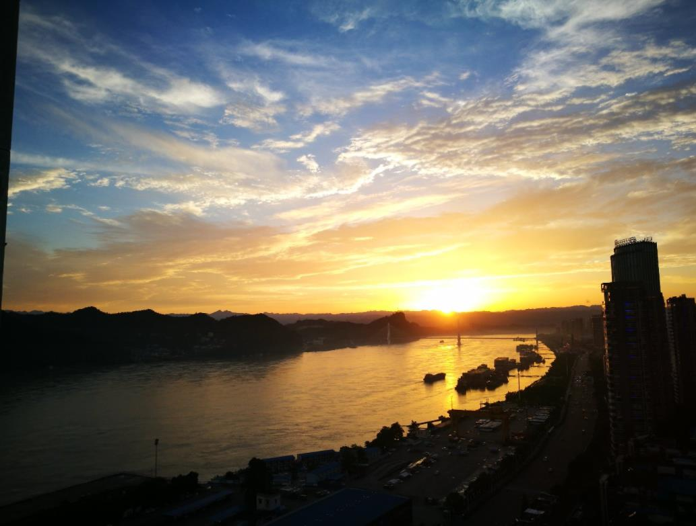

---
categories:
- ""
- ""
date: sys.date()
description: "My hometown"
draft: false
image: hometown.jpg
keywords: ""
slug: ipsum
title: My hometown
---

#  Description of my hometown

1.  My hometown - Yichang

    I come from China. My hometown is **Yichang**, a city near the Yangtze river. It is a very beautiful city. Yangtze river flows through this city, and there are ships as big as cruises and also ships as small as fishing fleets everytime I look into the river.



```{r}
getwd()
```

2. Beautiful scenery in Yichang

    **yichang** has so many AAAA scenic spots, including the three Gorges Dam.
    
> According to Wikipedia, The three Gorges Dam is a hydroelectric gravity dam that spans the Yangtze River by the town of Sandouping, in Yiling District, Yichang, Hubei province, central China, downstream of the Three Gorges. The Three Gorges Dam has been the world's largest power station in terms of installed capacity (22,500 MW) since 2012.The dam generates an average 95±20 TWh of electricity per year, depending on annual amount of precipitation in the river basin.After the extensive monsoon rainfalls of 2020, the dam's annual production nearly reached 112 TWh, breaking the previous world record of ~103 TWh set by Itaipu Dam in 2016.


2.  My favorite TV show 
    My favorite TV show is [*Better Call Saul*](https://www.netflix.com/gb/title/80021955). I love the light and shadow it presents in the show. The following picture is an example:

    


